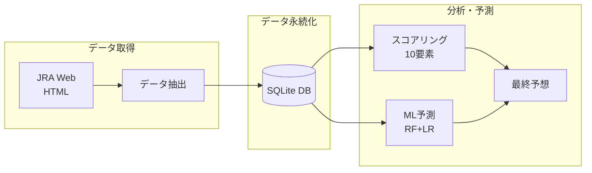
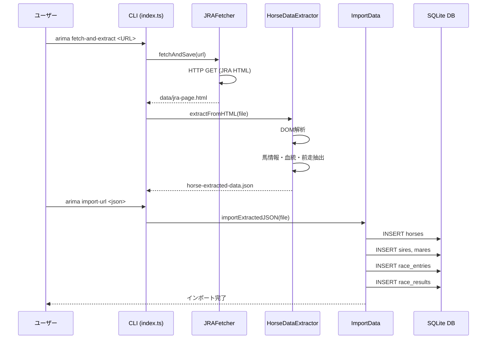
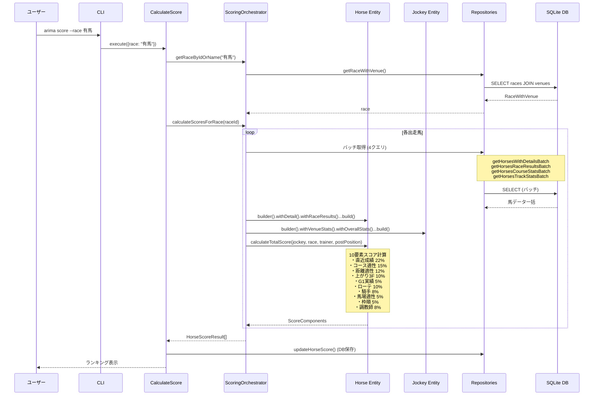
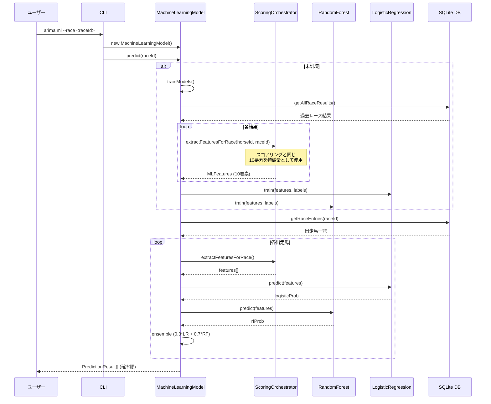
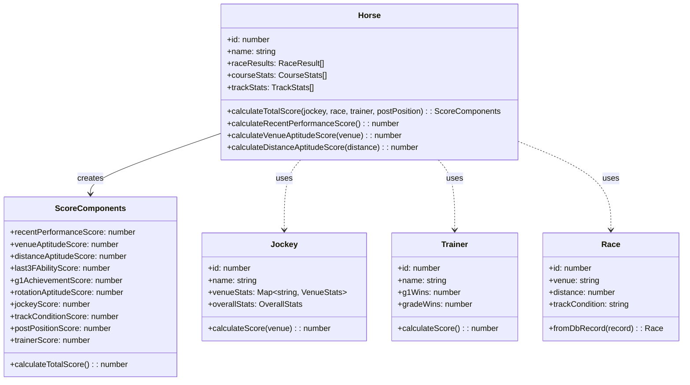
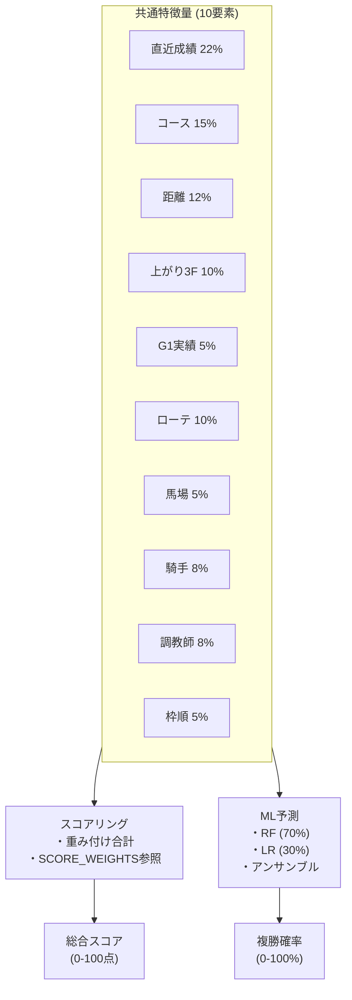
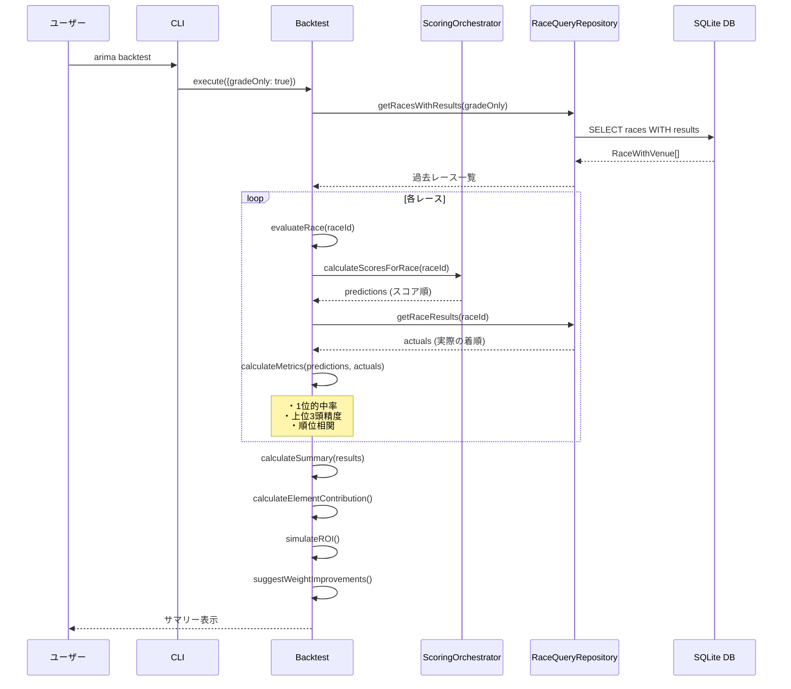
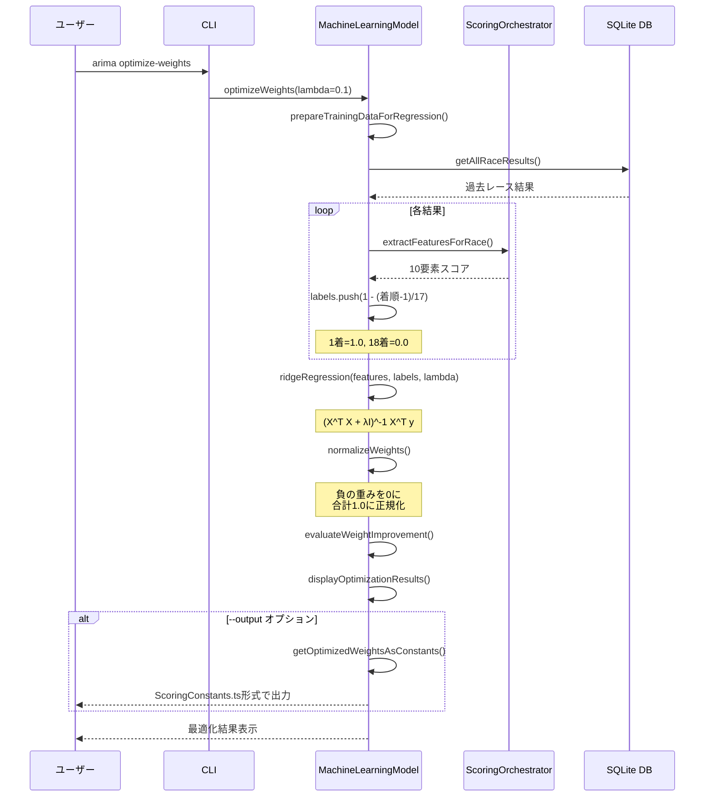

# アーキテクチャ

有馬記念分析システムの技術アーキテクチャとデータフローを説明します。

## 目次

- [システム概要](#システム概要)
- [処理フロー](#処理フロー)
- [スコアリングパイプライン](#スコアリングパイプライン)
- [ML予測パイプライン](#ml予測パイプライン)
- [バックテスト・重み最適化](#バックテスト・重み最適化)
- [レイヤー構成](#レイヤー構成)

---

## システム概要



---

## 処理フロー

### 1. データ取得・登録フロー



### 2. スコアリング予測フロー



### 3. ML予測フロー



---

## スコアリングパイプライン

### 10要素スコア計算

```mermaid
flowchart TB
    subgraph ability["馬の能力・実績 (59%)"]
        recent["直近成績 22%<br/>calculateRecentPerformanceScore()"]
        venue["コース適性 15%<br/>calculateVenueAptitudeScore()"]
        distance["距離適性 12%<br/>calculateDistanceAptitudeScore()"]
        last3f["上がり3F 10%<br/>calculateLast3FAbilityScore()"]
    end

    subgraph experience["実績・経験 (5%)"]
        g1["G1実績 5%<br/>calculateG1AchievementScore()"]
    end

    subgraph condition["コンディション (15%)"]
        rotation["ローテ適性 10%<br/>calculateRotationAptitudeScore()"]
        track["馬場適性 5%<br/>calculateTrackConditionScore()"]
    end

    subgraph human["人的要因 (16%)"]
        jockey["騎手能力 8%<br/>Jockey.calculateScore()"]
        trainer["調教師 8%<br/>Trainer.calculateScore()"]
    end

    subgraph post["枠順要因 (5%)"]
        postPos["枠順効果 5%<br/>getPostPositionScore()"]
    end

    recent --> total["総合スコア<br/>Σ(各要素 × 重み) = 100%"]
    venue --> total
    distance --> total
    last3f --> total
    g1 --> total
    rotation --> total
    track --> total
    jockey --> total
    trainer --> total
    postPos --> total
```



### エンティティ間の関係



---

## ML予測パイプライン

### 特徴量統一アーキテクチャ



---

## バックテスト・重み最適化

### バックテストフロー



### 重み最適化フロー



---

## レイヤー構成

```
src/
├── commands/                    # CLIコマンド層
│   ├── CalculateScore.ts       # スコアリング実行
│   ├── Backtest.ts             # バックテスト実行
│   ├── ImportData.ts           # データインポート
│   └── ...
│
├── domain/                      # ドメイン層 (DDD)
│   ├── entities/               # エンティティ
│   │   ├── Horse.ts           # 馬 (スコア計算ロジック内包)
│   │   ├── Jockey.ts          # 騎手
│   │   ├── Trainer.ts         # 調教師
│   │   ├── Race.ts            # レース
│   │   └── RaceResult.ts      # レース結果
│   │
│   ├── valueObjects/           # 値オブジェクト
│   │   ├── ScoreComponents.ts # 10要素スコア
│   │   └── Score.ts           # スコア値
│   │
│   └── services/               # ドメインサービス
│       └── ScoringOrchestrator.ts  # スコアリング統合
│
├── repositories/                # リポジトリ層
│   ├── queries/                # 参照系
│   │   ├── HorseQueryRepository.ts
│   │   ├── RaceQueryRepository.ts
│   │   └── JockeyQueryRepository.ts
│   │
│   └── aggregates/             # 更新系
│       ├── HorseAggregateRepository.ts
│       ├── RaceAggregateRepository.ts
│       └── ScoreAggregateRepository.ts
│
├── models/                      # 機械学習モデル
│   └── MachineLearningModel.ts # RF + LR アンサンブル
│
├── constants/                   # 定数
│   ├── ScoringConstants.ts     # 重み配分 (唯一の定義箇所)
│   ├── MLConstants.ts          # MLパラメータ
│   └── DistanceConstants.ts    # 距離カテゴリ
│
├── database/                    # DB関連
│   ├── DatabaseConnection.ts   # DB接続
│   └── schema.sql              # スキーマ定義
│
├── utils/                       # ユーティリティ
│   ├── JRAFetcher.ts           # JRA HTML取得
│   └── HorseDataExtractor.ts   # データ抽出
│
├── types/                       # 型定義
│   ├── HorseData.ts            # 馬データ型
│   └── RepositoryTypes.ts      # リポジトリ型
│
└── index.ts                     # CLIエントリポイント
```

---

## 関連ドキュメント

| ドキュメント | 内容 |
|-------------|------|
| [コマンドリファレンス](COMMANDS.md) | CLIコマンド・スキル完全リファレンス |
| [データベース構造](DATABASE.md) | テーブル定義、ER図、スキーマ詳細 |
| [分析モデル詳細](MODELS.md) | スコアリング・機械学習モデルの詳細 |
| [開発者向け情報](DEVELOPMENT.md) | 技術スタック、型定義、コーディング規約 |
